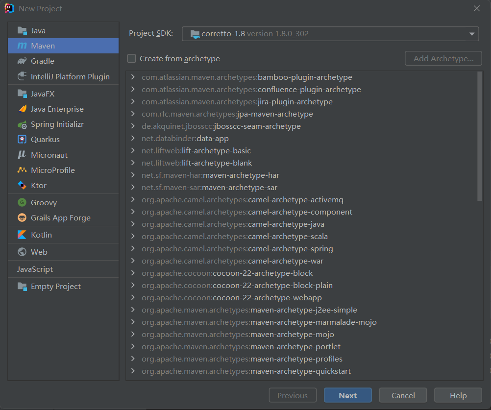
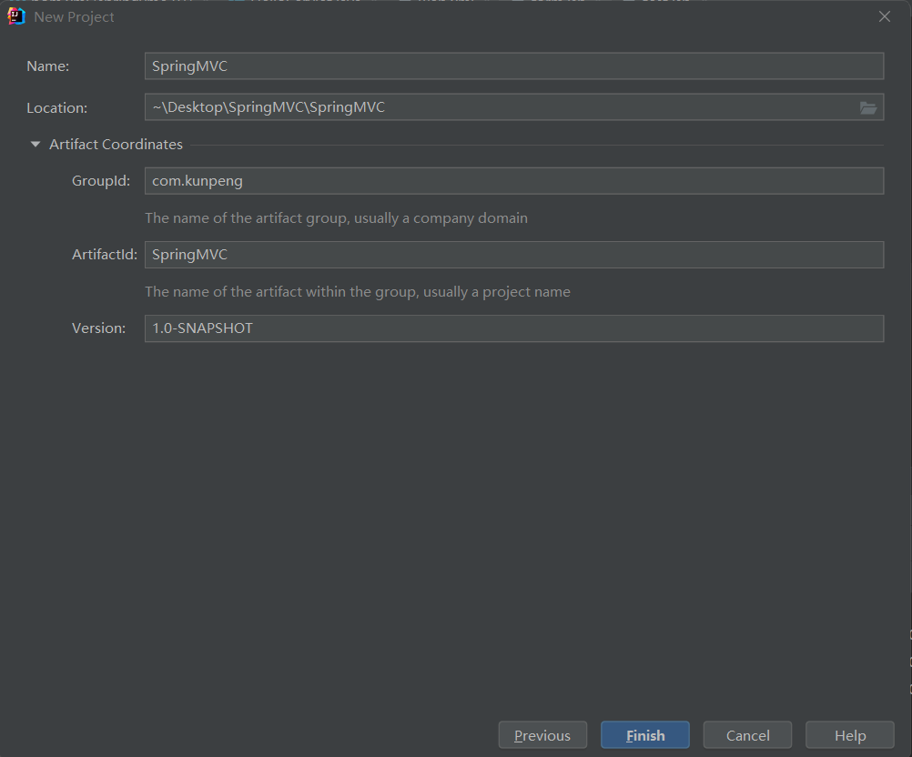
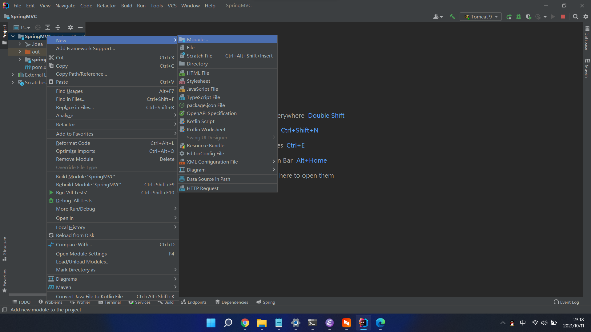
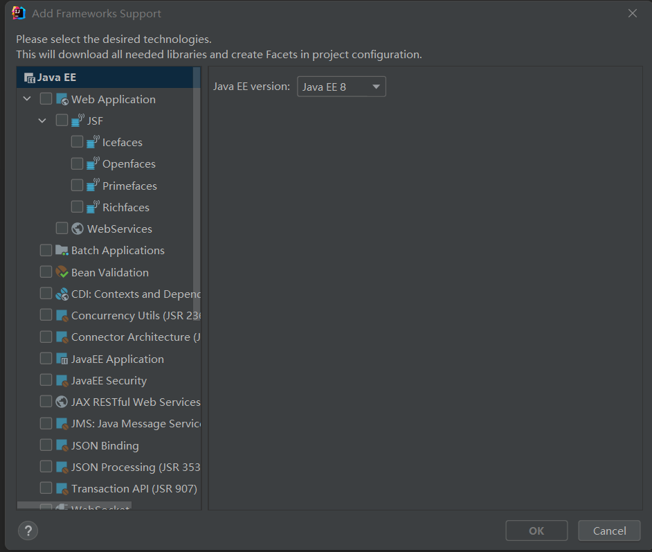
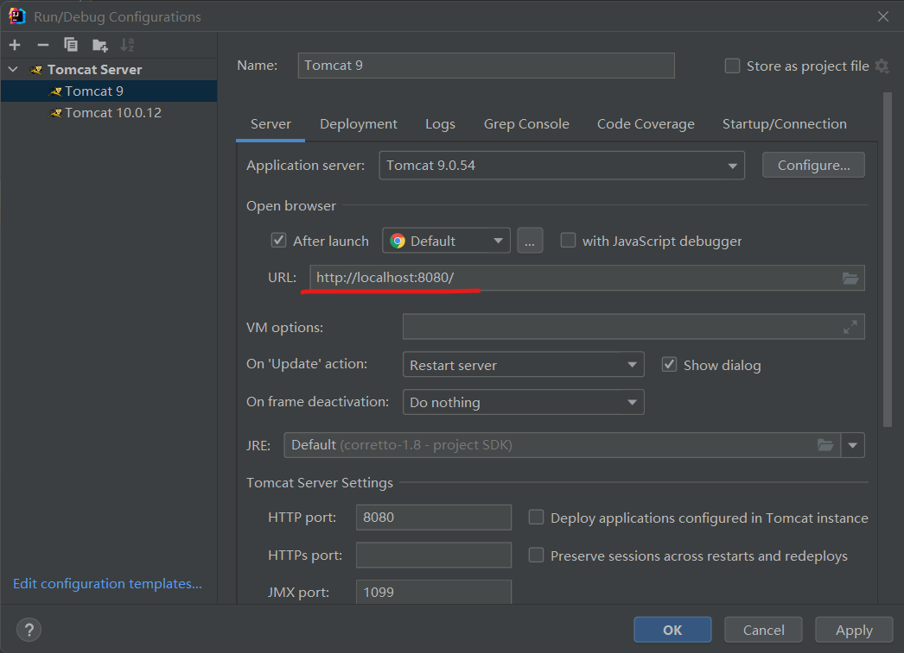
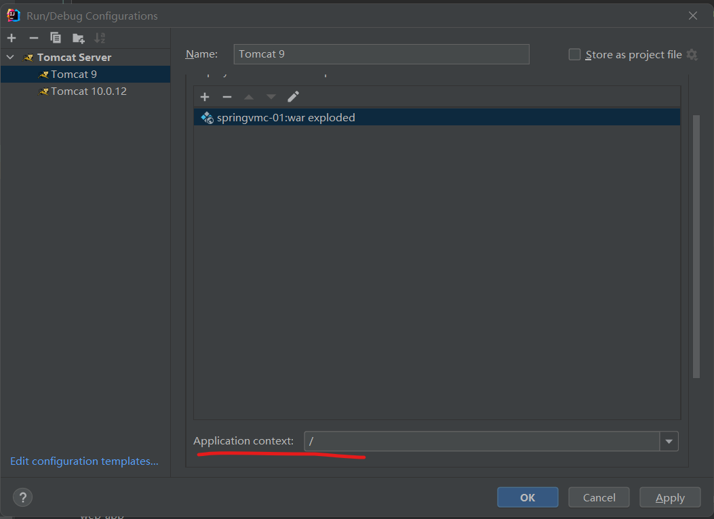
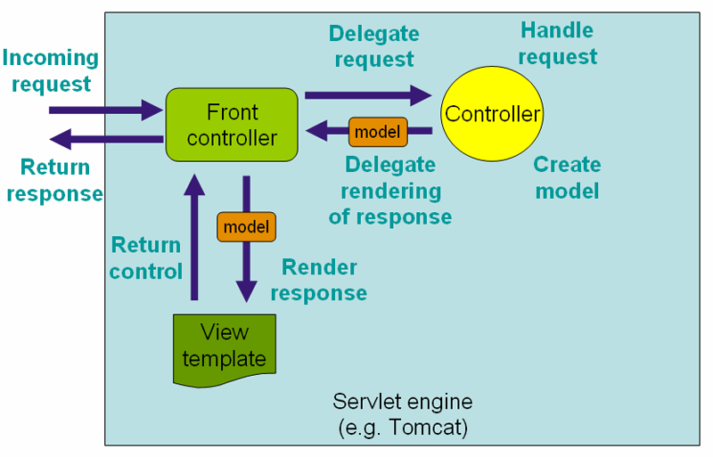

#+TITLE: Spring5
#+AUTHOR: KunPeng

* Spring5
*** AOP
**** 什么是AOP
***** 简介
AOP（Aspect Oriented
Programming）意为：面向切面编程，通过与编译的方式和运行期动态代理实现程序功能的同一维护的一种技术。
AOP是OOP的延续，是软件开发中的一个热点，也是Spring宽假中的一个重要内容，是函数式编程的一种衍生泛型。
利用AOP可以对业务逻辑的各个部分进行隔离，从而使得业务逻辑各部分之间的耦合度降低，提高程序的可用性，同时提高了开发的效率。

**** AOP在Spring中的作用
     :PROPERTIES:
     :CUSTOM_ID: orge56b22d
     :END:

<<text-orge56b22d>>
*提供声明式事务，允许用户自定义切面*

- 切面关注点：
  跨越应用程序多个模块的方法或功能。既是，与我们业务逻辑无关的，但是我们需要关注的部分，就是横切关注点。如日志，安全，缓存，事务等待。。。
- 切面（ASPECT）： 横切关注点被模块化的特殊对象。即，它是一个类。
- 通知（Advice）：切面必要完成的工作。即，它是类中的一个方法。
- 目标（target）：被通知的对象。
- 代理（Proxy）：想目标对象应用通知后创建的对象。
- 切入点（RointCut）：切面通知的执行的“地点”的定义。
- 连接点（JoinPoint）： 与切入点匹配的执行点。

<<outline-container-orgc2f98ba>>
**** 实现方式一，使用Spring实现AOP接口
     :PROPERTIES:
     :CUSTOM_ID: orgc2f98ba
     :END:

<<text-orgc2f98ba>>

<<outline-container-org468d955>>
***** 导入依赖包
      :PROPERTIES:
      :CUSTOM_ID: org468d955
      :END:

<<text-org468d955>>

#+BEGIN_EXAMPLE
    <dependency>
      <groupId>org.aspectj</groupId>
      <artifactId>aspectjweaver</artifactId>
      <version>1.9.6</version>
    </dependency>
    <dependency>
      <groupId>org.springframework</groupId>
      <artifactId>spring-webmvc</artifactId>
      <version>5.3.9</version>
    </dependency>
#+END_EXAMPLE

*ApplicationContext.xml配置文件模板*

#+BEGIN_EXAMPLE
    <?xml version="1.0" encoding="utf-8" ?>
    <beans xmlns="http://www.springframework.org/schema/beans"
           xmlns:xsi="http://www.w3.org/2001/XMLSchema-instance"
           xsi:schemaLocation="http://www.springframework.org/schema/beans
                   https://www.springframework.org/schema/beans/spring-beans.xsd">

    </beans>
#+END_EXAMPLE

UserService接口

#+BEGIN_EXAMPLE
    public interface UserService {
        public void add();
        public void delete();
        public void insert();
        public void query();
    }
#+END_EXAMPLE

UserServiceImpl实现类 模拟业务逻辑代码

#+BEGIN_EXAMPLE
    package com.kunpeng.service;

    public class UserServiceImpl implements UserService{
        @Override
        public void add() {
        System.out.println("添加了一个用户");
        }

        @Override
        public void delete() {
        System.out.println("删除了一个用户");
        }

        @Override
        public void insert() {
        System.out.println("插入了一个用户");
        }

        @Override
        public void query() {
        System.out.println("查询了一个用户");
        }
    }
#+END_EXAMPLE

Log实现日志，实现了MethodBeforeAdvice接口，想要实现功能增强，必须实现Advice的接口或者类

#+BEGIN_EXAMPLE
    public class Log implements MethodBeforeAdvice {
        //method： 执行目标方法
        //objects： 参数
        @Override
        public void before(Method method, Object[] objects, Object o)
        throws Throwable {
        System.out.println(o.getClass().getName()+"的"
                   +method.getName()+"方法执行了");

        }
    }
#+END_EXAMPLE

注册bean，并配置aop，对业务逻辑代码进行增强

#+BEGIN_EXAMPLE
    <!--    注册bean-->
    <bean id="userService" class="com.kunpeng.service.UserServiceImpl"/>
    <bean id="log" class="com.kunpeng.log.Log"/>
    <bean id="afterLog" class="com.kunpeng.log.AfterLog"/>

    <!--    配置AOP:需要导入aop约束-->
    <aop:config>
      <!--        expression表达式：execution（）-->
      <aop:pointcut id="pointcut" expression="execution(* com.kunpeng.service.UserServiceImpl.*(..))"/>
      <!--        advice-ref切入方法，pointcut-ref切入点-->
      <aop:advisor advice-ref="log" pointcut-ref="pointcut"/>
    </aop:config>
#+END_EXAMPLE

测试类

#+BEGIN_EXAMPLE
    public class MyTest {
        public static void main(String[] args) {
        ClassPathXmlApplicationContext context =
            new ClassPathXmlApplicationContext("applicationContext.xml");
        UserService userService = (UserService) context.getBean("userService");
        userService.add();
        //outuput:
        //com.kunpeng.service.UserServiceImpl的add方法执行是
        //添加了一个用户
        }
    }
#+END_EXAMPLE

<<outline-container-org28c51b3>>
**** 实现方式二，使用自定义aop实现
     :PROPERTIES:
     :CUSTOM_ID: org28c51b3
     :END:

<<text-org28c51b3>>
编写diy类,该类有两个方法，一个在方法执行前执行，一个在方法执行后执行

#+BEGIN_EXAMPLE
    public class DyiPointCut {
        public void before(){
        System.out.println("================方法执行前====================");
        }
        public void after(){
        System.out.println("================方法执行后====================");
        }
    }
#+END_EXAMPLE

修改xml配置aop

#+BEGIN_EXAMPLE
    <!--注册diy类-->
    <bean id="diy" class="com.kunpeng.diy.DyiPointCut"/>
    <!--配置aop：config-->
    <aop:config>
      <!--aspect切面，将diy自定义类切入业务逻辑代码-->
      <aop:aspect ref="diy">
        <!--expression表达式来确定那些类和方法需要增强-->
        <aop:pointcut id="point"
              expression="execution(* com.kunpeng.service.UserServiceImpl.*(..))"/>
        <!--aop:fefore 代码执行前运行diy类的before方法-->
        <aop:before method="before" pointcut-ref="point"/>
        <!--aop:after 代码执行后运行diy类的after方法-->
        <aop:after method="after" pointcut-ref="point"/>
      </aop:aspect>
    </aop:config>
#+END_EXAMPLE

测试

#+BEGIN_EXAMPLE
    public class MyTest {
        public static void main(String[] args) {
        ClassPathXmlApplicationContext context =
            new ClassPathXmlApplicationContext("applicationContext.xml");
        UserService userService = (UserService) context.getBean("userService");
        userService.delete();
        //output：
        //================方法执行前====================
        //删除了一个用户
        //================方法执行后====================

        }
    }
#+END_EXAMPLE

<<outline-container-orgdf3810f>>
**** 实现方式三，使用注解方式实现aop接口
     :PROPERTIES:
     :CUSTOM_ID: orgdf3810f
     :END:

<<text-orgdf3810f>>
注解切片类AnnotationPointCut 类

#+BEGIN_EXAMPLE
    // 和自定义aop实现的方式类似，只不过用的是注解的方式，
    //在类上添加Aspect注解代表这是一个切面类
    @Aspect
    public class AnnotationPointCut {
        //Before在方法执行前执行下面的方法，需要写execution表达式
        @Before("execution(* com.kunpeng.service.UserServiceImpl.*(..))")
        public void before(){
        System.out.println("===========方法执行前============");
        }
        //After与Before注解类似
        @After("execution(* com.kunpeng.service.UserServiceImpl.*(..))")
        public void after(){
        System.out.println("============方法执行后==============");
        }
        //Around环绕，接管业务代码执行权
        //pj.proceed();接管业务执行权，只有运行在这一步前会执行Before下的方法和执行完这一步后执行After下的方法
        @Around("execution(* com.kunpeng.service.UserServiceImpl.*(..))")
        public void around(ProceedingJoinPoint pj) throws Throwable {
        System.out.println("环绕前");
        Object proceed = pj.proceed(); //接管业务
        System.out.println("环绕后");

        Signature signature = pj.getSignature(); // 签名
        System.out.println(signature);
        //环绕前
        //===========方法执行前============
        //删除了一个用户
        //============方法执行后==============
        //环绕后
        //void com.kunpeng.service.UserService.delete()
        }

    }
#+END_EXAMPLE

xml配置

#+BEGIN_EXAMPLE
    <!--注册bean-->
      <bean id="annotationPointCut"
        class="com.kunpeng.annotation.AnnotationPointCut"/>
    <!--开启下面就行，不需要过多的配置-->
      <aop:aspectj-autoproxy/>
#+END_EXAMPLE

<<outline-container-orgbd5fa8b>>
**** execution表达式
     :PROPERTIES:
     :CUSTOM_ID: orgbd5fa8b
     :END:

<<text-orgbd5fa8b>>
*上面三种实现方法中都使用到了execution表达式，来拦截指定的方法进行增强*

<<outline-container-orga3a3dae>>
***** 拦截任意公共方法
      :PROPERTIES:
      :CUSTOM_ID: orga3a3dae
      :END:

<<text-orga3a3dae>>

#+BEGIN_EXAMPLE
    execution(public * *(..))
#+END_EXAMPLE

<<outline-container-org6909854>>
***** 拦截以set开头的任意方法
      :PROPERTIES:
      :CUSTOM_ID: org6909854
      :END:

<<text-org6909854>>

#+BEGIN_EXAMPLE
    execution(* set*(..))
#+END_EXAMPLE

<<outline-container-org8a27b1b>>
***** 拦截类或者接口中的方法
      :PROPERTIES:
      :CUSTOM_ID: org8a27b1b
      :END:

<<text-org8a27b1b>>
拦截AccountService(类、接口)中定义的所有方法

#+BEGIN_EXAMPLE
    execution(* com.xyz.service.AccountService.*(..))
#+END_EXAMPLE

<<outline-container-orgdc2fb88>>
***** 拦截包中定义的方法，不包含子包中的方法
      :PROPERTIES:
      :CUSTOM_ID: orgdc2fb88
      :END:

<<text-orgdc2fb88>>
拦截com.xyz.service包中所有类中任意方法，不包含子包中的类

#+BEGIN_EXAMPLE
    execution(* com.xyz.service.*.*(..))
#+END_EXAMPLE

<<outline-container-org920df0f>>
***** 拦截包或子包中定义的方法
      :PROPERTIES:
      :CUSTOM_ID: org920df0f
      :END:

<<text-org920df0f>>
拦截com.xyz.service包或者子包中定义的所有方法

#+BEGIN_EXAMPLE
    execution(* com.xyz.service..*.*(..))
#+END_EXAMPLE

<<outline-container-org7f61e46>>
*** spring装配beans
    :PROPERTIES:
    :CUSTOM_ID: org7f61e46
    :END:

<<text-org7f61e46>>

<<outline-container-org4efdd34>>
***** 使用xml手动装配
      :PROPERTIES:
      :CUSTOM_ID: org4efdd34
      :END:

<<outline-container-orgfa4dfc5>>
***** 使用xml自动装配
      :PROPERTIES:
      :CUSTOM_ID: orgfa4dfc5
      :END:

<<outline-container-org905659e>>
***** 使用注解自动装配
      :PROPERTIES:
      :CUSTOM_ID: org905659e
      :END:

<<text-org905659e>>
开启注解支持

#+BEGIN_EXAMPLE
    <context:annotation-config/>
#+END_EXAMPLE

- 直接在属性上使用即可！ 也可以在set方式上使用！
- 使用Autowired可以不用编写Set方法，前提是这个自动专配的属性在IOC（Spring）容器中存在（即注册了bean），且符合名字的byName！
- @Autowired注解可以传入一个参数required，默认情况下required为true，表示这个值不能为空，如果运行为空，则将该值改为false即可。
- 如果@Autowired自动专配的环境比较复制，自动装配无法通过一个注解@Autowired完成的时候，可以使用@Qualifier(value="xxx")配置@Autowired的使用，指定一个唯一的bean对象注入！
- @Autowried先匹配bytype再匹配byname，如果都没有匹配到报错。
- @Resource先匹配byname再匹配bytype，如果没有匹配到就报错

<<outline-container-orgd3f2e33>>
* Spring MVC
SpringMVC 框架简介
MVC是指model-view-controller三层架构，springMVC框架默认使用
*DispatcherServlet*
处理请求，配置程序映射,视图解析，区域设置和主题解析和上传文件。
程序处理默认基于 *@Controller* 和 *@RequestMapping* ，再Spring3.0中，再
*@Controller* 的基础上添加了 *@PathVariable* 注解创建RESTful
web网站和应用程序。
** 基本使用
*** 开闭原则
    :PROPERTIES:
    :CUSTOM_ID: org404699d
    :END:

<<text-org404699d>>
SpringMVC关键的设计原则是面向对象中的 *开闭原则*
开闭原则是指：开放和关闭，开放是指对扩展开放，关闭是指对修改代码关闭。

<<outline-container-org543e0ff>>
*** SpringMVC环境搭建
    :PROPERTIES:
    :CUSTOM_ID: org543e0ff
    :END:

<<text-org543e0ff>>
在idea中，创建一个空的maven项目，创建完成之后删除src目录，这是一个父maven项目，保留pom.xml即可
 
在父maven项目中的pom.xml中添加公共依赖

#+BEGIN_EXAMPLE
    <dependencies>
      <dependency>
        <groupId>junit</groupId>
        <artifactId>junit</artifactId>
        <version>4.13.2</version>
        <scope>test</scope>
      </dependency>
      <dependency>
        <groupId>org.springframework</groupId>
        <artifactId>spring-webmvc</artifactId>
        <version>5.3.9</version>
      </dependency>
      <dependency>
        <groupId>javax.servlet</groupId>
        <artifactId>servlet-api</artifactId>
        <version>2.5</version>
      </dependency>
      <dependency>
        <groupId>javax.servlet.jsp</groupId>
        <artifactId>jsp-api</artifactId>
        <version>2.2</version>
      </dependency>
      <dependency>
        <groupId>javax.servlet</groupId>
        <artifactId>jstl</artifactId>
        <version>1.2</version>
      </dependency>
    </dependencies>
#+END_EXAMPLE

添加依赖之后刷新pom.xml，将依赖导入，在idea中点击右侧的Maven，查看dependencies依赖是否导入。
导入成功之后，创建Model项目，Model项目和父Maven项目一样，创建的时候不需要选择任何依赖。
 创建完成之后，在model项目中右击，选择add
framework support选项，添加Web
Application依赖，并选择4.0版本，勾选create xml.
 完成环境搭建开始创建测试类 HelloServlet 类

#+BEGIN_EXAMPLE
    public class HelloServlet extends HttpServlet {
        @Override
        protected void doGet(HttpServletRequest req, HttpServletResponse resp) throws ServletException, IOException {
        String method = req.getParameter("method");
        if(method.equals("add")){
            req.getSession().setAttribute("msg","执行了add方法");
        }
        if (method.equals("delete")){
            req.getSession().setAttribute("msg","执行了delete方法");
        }
        req.getRequestDispatcher("/WEB-INF/jsp/test.jsp").forward(req,resp);
        }

        @Override
        protected void doPost(HttpServletRequest req, HttpServletResponse resp) throws ServletException, IOException {
        doGet(req, resp);
        }
    }
#+END_EXAMPLE

在WEB-INF/jsp目录下创建test.jsp文件,写入下面代码，一般情况下idea会自动生成

#+BEGIN_EXAMPLE
    <%@ page contentType="text/html;charset=UTF-8" language="java" %>
    <html>
    <head>
        <title>Title</title>
    </head>
    <body>
    ${msg}
    </body>
    </html>
#+END_EXAMPLE

在WEB-INF目录下创建form.jsp文件，写入以下代码，用于提交表达

#+BEGIN_EXAMPLE
    <%@ page contentType="text/html;charset=UTF-8" language="java" %>
    <html>
    <head>
        <title>Title</title>
    </head>
    <body>

    <form action="/hello">
        <input type="text" name="method">
        <input type="submit">
    </form>

    </body>
    </html>
#+END_EXAMPLE

最后编辑web.xml文件配置映射路径

#+BEGIN_EXAMPLE
    <?xml version="1.0" encoding="UTF-8"?>
    <web-app xmlns="http://xmlns.jcp.org/xml/ns/javaee"
         xmlns:xsi="http://www.w3.org/2001/XMLSchema-instance"
         xsi:schemaLocation="http://xmlns.jcp.org/xml/ns/javaee http://xmlns.jcp.org/xml/ns/javaee/web-app_4_0.xsd"
         version="4.0">
       <!--添加下面内容-->
        <servlet>
        <servlet-name>hello</servlet-name>
        <servlet-class>com.kunpeng.HelloServlet</servlet-class>
        </servlet>
        <servlet-mapping>
        <servlet-name>hello</servlet-name>
        <url-pattern>/hello</url-pattern>
        </servlet-mapping>
    </web-app>
#+END_EXAMPLE

<<outline-container-org2f1cac4>>
**** tomcat
     :PROPERTIES:
     :CUSTOM_ID: org2f1cac4
     :END:

<<text-org2f1cac4>>
最后配置tomcat服务器就行了，tomcat需要注意几点。

- 使用tomcat9.0，不要使用tomcat10，注意使用版本。
- 乱码，修改tomcat配置文件，配置文件位于conf目录下，修改logging.properties文件，找到encoding字段，注意encoding有好几个，默认使用的是UTF-8，改为GBK即可。
- 运行之后报404错误，需要修改idea中tomcat的配置如下。

  URL和Application
Context的映射地址需要一样，这里都是/路径。

<<outline-container-org23cca34>>
**** 小结
     :PROPERTIES:
     :CUSTOM_ID: org23cca34
     :END:

<<text-org23cca34>>
SpringMVC环境搭建步骤：

- 新建一个web项目
- 导入相关jar包
- 编写web.xml，注册DispatcherServlet
- 编写springmvc配置文件
- 创建对应的控制类，controller
- 最后完善前端视图和controller之间的对应关系
- 测试运行调试

使用springMVC必须配置三大件： *处理器映射器，处理器适配器，试图解析器*

通常我们只需要手动配置试图解析器，而处理器映射其和处理器适配器只需要开启注解即可。

<<outline-container-org62357a1>>
*** 重定向与转发
    :PROPERTIES:
    :CUSTOM_ID: org62357a1
    :END:

<<text-org62357a1>>

<<outline-container-orgb1ce078>>
**** Redirect（重定向）
     :PROPERTIES:
     :CUSTOM_ID: orgb1ce078
     :END:

<<text-orgb1ce078>>
重定向是指当浏览器请求一个URL时，服务器返回一个重定向指令，告诉浏览器地址已经变了，需要浏览器使用新的URL地址再次发送请求。

浏览器一共需要发送两次请求。

重定向有两种：

- 一种是302响应，称为临时重定向，浏览器不会缓存这个重定向的的关联。
- 一种是301响应，称为永久重定向，浏览器在第一次发送请求的时候，服务器发送一个重定向的地址给浏览器，浏览器再次发送请求。当浏览器缓存了两个地址的关联之后，浏览器直接发送请求给重定向后的地址。

<<outline-container-orge92f5b0>>
**** Forward（转发）
     :PROPERTIES:
     :CUSTOM_ID: orge92f5b0
     :END:

<<text-orge92f5b0>>
Forword是指内部转发，当一个Servlet处理请求的时候，它可以决定自己不继续处理，二至转发给另一个Servlet处理。
当浏览器发送请求到Servlet时，Servlet自己不处理这个请求，而是将这个请求转发到另一个Servlet，并将这个Servlet放回的内容发送给浏览器，这个过程是在服务器内部处理的，浏览器只发送一次请求，浏览器显示的还是原来的地址。

<<outline-container-org9faf90b>>
**** 测试
     :PROPERTIES:
     :CUSTOM_ID: org9faf90b
     :END:

<<text-org9faf90b>>

#+BEGIN_EXAMPLE
    //使用get方法
    @GetMapping("/add/{a}/{b}")
    public String test(@PathVariable int a, @PathVariable int b, Model model){
        int res = a + b;
        model.addAttribute("msg", "结果为:"+res);
        // return "forward:/test"
        return "test";
    }
    //使用post方法
    @PostMapping("/add/{a}/{b}")
    public String test2(@PathVariable int a, @PathVariable int b, Model model){
        int res = a + b;
        model.addAttribute("msg","结果为1:"+res);
        return "redirect:/index.jsp";
    }
#+END_EXAMPLE

在上面的例子中，第一个test方法使用的是转发，test1中使用的是重定向，转
发可以不用谢forward，重定向必须写redirect。

<<outline-container-orgae4a4a6>>
*** DispatcherServlet
    :PROPERTIES:
    :CUSTOM_ID: orgae4a4a6
    :END:

<<text-orgae4a4a6>>
Spring 的 Web MVC 框架与许多其他 Web MVC
框架一样，是请求驱动的，围绕一个中央 Servlet 设计，该 Servlet
将请求分派给控制器并提供其他功能以促进 Web 应用程序的开发。 然而，Spring
的 DispatcherServlet 不仅仅如此。 它与 Spring IoC
容器完全集成，因此允许您使用 Spring 具有的所有其他功能。

Spring Web MVC DispatcherServlet 的请求处理工作流程如下图所示。
精通模式的读者会认识到 DispatcherServlet
是“前端控制器”设计模式的表达（这是 Spring Web MVC 与许多其他领先的 Web
框架共享的模式）。

<<org11d9ba8>>

*DispatcherServlet实际上也是一个Servlet（继承了HttpServlet）。*

使用DispatcherServlet需要在web.xml中添加如下配置。

#+BEGIN_EXAMPLE
    <web-app>

        <servlet>
        <servlet-name>example</servlet-name>
        <servlet-class>org.springframework.web.servlet.DispatcherServlet</servlet-class>
        <load-on-startup>1</load-on-startup>
        </servlet>

        <servlet-mapping>
        <servlet-name>example</servlet-name>
        <url-pattern>/example/*</url-pattern>
        </servlet-mapping>

    </web-app>
#+END_EXAMPLE

在上面的这个示例中，所有的以/example开头的请求都将由DispatcherServlet进行处理，将请求的路径分发到对应的Controller中。

下面的例子使用java代码编写，等同于上面的xml配置

#+BEGIN_EXAMPLE
    public class MyWebApplicationInitializer implements WebApplicationInitializer {

        @Override
        public void onStartup(ServletContext container) {
        ServletRegistration.Dynamic registration = container.addServlet("dispatcher", new DispatcherServlet());
        registration.setLoadOnStartup(1);
        registration.addMapping("/example/*");
        }

    }
#+END_EXAMPLE

<<outline-container-org7fa03fe>>
*** RestFul风格
    :PROPERTIES:
    :CUSTOM_ID: org7fa03fe
    :END:

<<text-org7fa03fe>>
Rest就是一个资源定位操作的风格。不是标准也不是协议，只是一种风格。基于这个风格设计的软件可以更加的简洁，更有层次，更易于实现缓存等机制。

<<outline-container-org15f9723>>
**** 功能
     :PROPERTIES:
     :CUSTOM_ID: org15f9723
     :END:

<<text-org15f9723>>

- 资源：互联网中所有的事物都可以被抽象为资源。
- 资源操作：使用POST，DELETE，PUT，GET，使用不同方法对资源进行操作。
- 分别对应：添加，删除，修改，查询。

<<outline-container-org84b080b>>
**** 传统的方式操作资源
     :PROPERTIES:
     :CUSTOM_ID: org84b080b
     :END:

<<text-org84b080b>>

- [[http://127.0.0.1/item/queryItem.action?id=1]] 查询
- [[http://127.0.0.1/item/saveItem.action]] 新增
- ...

<<outline-container-org2f64cee>>
**** 使用RESTful操作资源
     :PROPERTIES:
     :CUSTOM_ID: org2f64cee
     :END:

<<text-org2f64cee>>

- [[http://127.0.0.1/item/1]] 查询
- [[http://127.0.0.1/item]] 新增
- ...

<<outline-container-org1c6b25d>>
**** 测试
     :PROPERTIES:
     :CUSTOM_ID: org1c6b25d
     :END:

<<text-org1c6b25d>>
使用传统的方式

#+BEGIN_EXAMPLE
    // 请求路径http://127.0.0.1/add?a=1&b=2
    @Controller
      public class RESTfulController {
          @RequestMapping("/add")
          public String test(int a, int b, Model model){
          int res = a + b;
          model.addAttribute("msg", "结果为:"+res);
          return "test";
          }
      }
#+END_EXAMPLE

使用RESTful风格

#+BEGIN_EXAMPLE
    //http://127.0.0.1/add/1/2
    @Controller
    public class RESTfulController {
        @RequestMapping("/add/{a}/{b}")
        public String test(@PathVariable int a, @PathVariable int b, Model model){
        int res = a + b;
        model.addAttribute("msg", "结果为:"+res);
        return "test";
        }
    }
#+END_EXAMPLE

两种方式都实现了相同的功能，但是RESTful风格更加简洁和易于理解。

RESTful风格还能实现相同的路径实现不同的功能

- [[http://127.0.0.1/item]] 添加
- [[http://127.0.0.1/item]] 更新

上面的两个URL地址相同却能实现不同的功能。

#+BEGIN_EXAMPLE
    //使用get方法
    @GetMapping("/add/{a}/{b}")
    public String test(@PathVariable int a, @PathVariable int b, Model model){
        int res = a + b;
        model.addAttribute("msg", "结果为:"+res);
        return "test";
    }
    //使用post方法
    @PostMapping("/add/{a}/{b}")
    public String test2(@PathVariable int a, @PathVariable int b, Model model){
        int res = a + b;
        model.addAttribute("msg","结果为1:"+res);
        return "test";
    }
#+END_EXAMPLE

上面的两个方法中,使用的url地址都是一样的，但是请求的方式不一样，使用不
同的方式请求统一个url地址，也就能实现不同的功能了。

<<outline-container-org1f287df>>
*** SpringMVC数据处理
    :PROPERTIES:
    :CUSTOM_ID: org1f287df
    :END:

<<text-org1f287df>>

<<outline-container-org290bd3c>>
**** 处理提交数据
     :PROPERTIES:
     :CUSTOM_ID: org290bd3c
     :END:

<<text-org290bd3c>>

<<outline-container-org6e6b108>>
***** 提交的域名名称和处理方法的参数明一致
      :PROPERTIES:
      :CUSTOM_ID: org6e6b108
      :END:

<<text-org6e6b108>>
提交数据：[[http://127.0.0.1/hello?name=kunpeng]]

处理方法

#+BEGIN_EXAMPLE
    @GetMapping("/hello")
    public String hello(String name){
        System.out.println(name);
        return "hello";
    }
#+END_EXAMPLE

<<outline-container-org538589f>>
***** 提交的域名名称和处理方法的参数名不一致
      :PROPERTIES:
      :CUSTOM_ID: org538589f
      :END:

<<text-org538589f>>
提交数据：[[http://127.0.0.1/hello?username=kunpeng]]

处理方法

#+BEGIN_EXAMPLE
    @GetMapping("/hello")
    public String hello(@RequestParam("username") String name){
        System.out.println(name);
        return "hello";
    }
#+END_EXAMPLE

<<outline-container-org28a6c6d>>
***** 提交的数据是个对象类
      :PROPERTIES:
      :CUSTOM_ID: org28a6c6d
      :END:

<<text-org28a6c6d>>
如果提交的数据是个对象,就需要封装成实体类

#+BEGIN_EXAMPLE
    //忽略了构造函数,get/set和toString方法
    public class User {
        private int id;
        private String name;
        private int age;
    }
#+END_EXAMPLE

提交数据: [[http://127.0.0.1/user?id=1&name=kunpeng&age=21]]

处理方法

#+BEGIN_EXAMPLE
    @GetMapping("/user")
    public String user(User user){
        System.out.println(user);
        return "hello";
    }
#+END_EXAMPLE

<<outline-container-org8e50053>>
*** 解决乱码问题
    :PROPERTIES:
    :CUSTOM_ID: org8e50053
    :END:

<<text-org8e50053>>
在Spring开发中,会有各种乱码的问题,有些来自前端,有些来自后端,有些来自
tomcat服务器,乱码问题层出不穷,没有一种方法能解决所有乱码问题,都是需要
根据实际情况进行分析.

下面是Spring后端解决乱码的方法,在web.xml中添加过滤器.

#+BEGIN_EXAMPLE
    <filter>
      <filter-name>encoding</filter-name>
      <filter-class>org.springframework.web.filter.CharacterEncodingFilter</filter-class>
      <init-param>
        <param-name>encoding</param-name>
        <param-value>utf-8</param-value>
      </init-param>
    </filter>
    <filter-mapping>
      <filter-name>encoding</filter-name>
      <url-pattern>/*</url-pattern>
    </filter-mapping>
#+END_EXAMPLE

这是Spring提供的过滤器,一般情况下能够解决乱码问题,如果还是不能解决,可
以自己定过滤器类.

<<outline-container-org7f82bd2>>
**** JSON乱码解决
     :PROPERTIES:
     :CUSTOM_ID: org7f82bd2
     :END:

<<text-org7f82bd2>>
在springmvc-servlet.xml中添加下面配置即可

#+BEGIN_EXAMPLE
    <mvc:annotation-driven>
      <mvc:message-converters register-defaults="true">
        <bean class="org.springframework.http.converter.StringHttpMessageConverter">
          <property name="supportedMediaTypes">
        <list>
          <value>text/html;charset=UTF-8</value>
          <value>application/json;charset=UTF-8</value>
          <value>text/plain;charset=UTF-8</value>
          <value>application/xml;charset=UTF-8</value>
        </list>
          </property>
        </bean>
      </mvc:message-converters>
    </mvc:annotation-driven>
#+END_EXAMPLE

<<outline-container-org2902d3c>>
*** Json数据格式
    :PROPERTIES:
    :CUSTOM_ID: org2902d3c
    :END:

<<text-org2902d3c>>

<<outline-container-orga1c8f33>>
**** 什么是Json
     :PROPERTIES:
     :CUSTOM_ID: orga1c8f33
     :END:

<<text-orga1c8f33>>

- JSON(JavaScript Object Notation,JS对象标记)是一种轻量级的数据交换格式,

目前使用特别广泛.

- 完全独立于编程语言的 *文本格式* 来存储和表示数据.
- 简洁和清晰的层次结构使得JSON成为理想的数据交换语言.
- 易于阅读和编写,同时也易于机器解析和生成,并有效的提高网络传速效率

在JavaScript语言中,一切皆对象,应此,任何支持JavaScript的类型都可通过
JSON来进行表示,例如字符串,数组,对象,数字等.

语法格式:

- 对象由键值对表示,由逗号分开
- 花括号保存对象
- 放括号保存数组

前端JSON

#+BEGIN_EXAMPLE
    // 创建一个JavaScript对象
    var user = {
        id:1,
        name:"wuguipeng",
        age:21
    };

    console.log(user);

    var user1 = JSON.stringify(user); //将对象转为JSON
    console.log(user1)

    var user2 = JSON.parse(user1); //将JSON转为对象
    console.log(user2);
#+END_EXAMPLE

后端JSON

后端使用Jackson解析工具,也可以使用其他的JSON解析工具,比如阿里巴巴的
fastjson.

使用Jackson先导入依赖

#+BEGIN_EXAMPLE
    <dependency>
      <groupId>com.fasterxml.jackson.core</groupId>
      <artifactId>jackson-databind</artifactId>
      <version>2.12.5</version>
    </dependency>
#+END_EXAMPLE

编写Controller类

#+BEGIN_EXAMPLE
    @ResponseBody
    @GetMapping("/test1")
    public String test1() throws JsonProcessingException {
        ObjectMapper mapper = new ObjectMapper();
        User kunpeng = new User(1, "吴桂鹏", 21);
        String s = mapper.writeValueAsString(kunpeng);
        return s;
    }
#+END_EXAMPLE

在上面的实例中使用了@ResponseBody注解,被这个注解标注的方法返回的时候不
会走视图解析,而是直接返回字符串. 在方法中创建了一个ObjectMapper实
例,ObjectMapper是Jackson包中的对象,用于JSON转换. 将对象转换为JSON之后
直接返回.

编写JsonUtils工具类

#+BEGIN_EXAMPLE
    public class JsonUtils {
        public static String getJson(Object object){
        return getJson(object,"");
        }

        public static String getJson(Object object, String dateFormat){
        ObjectMapper mapper = new ObjectMapper();
        mapper.configure(SerializationFeature.WRITE_DATE_KEYS_AS_TIMESTAMPS,false); //关闭默认转换为时间戳
        SimpleDateFormat sdf = new SimpleDateFormat(dateFormat); //设置指定的时间格式
        mapper.setDateFormat(sdf);
        try {
            return mapper.writeValueAsString(object);

        } catch (JsonProcessingException e) {
            e.printStackTrace();
        }
        return null;
        }
    }
#+END_EXAMPLE

这个工具类又两个重载方法,用于对象的转换和时间的转换,时间可以指定格式化.
*** SpringMVC 拦截器
    SpringMVC的处理器拦截器类似于Servlet开发中的过滤器Filter，用于对处理器进行预处理和后处理.
    开发者可以自己定义一些拦截器来实现特定的功能。

     *过滤器和拦截器的区别*: 拦截器是AOP思想的具体应用

     *过滤器*
     + servlet 规范中的一部分，任何java web工程都可以使用
     + 在url－pattern中配置了/* 后，可以对所要访问的资源进行拦截

     *拦截器*
     + 拦截器是SpringMVC框架自己的，只有使用了SpringMVC框架的工程才能使用
     + 拦截器只会访问拦截器的控制方法，如果访问jsp/html/css/

     拦截器会拦截一些不符合要求的请求，例如：用户登入，用户权限等，通过过滤来保证应用程序的安全性。
**** 实现
     SCHEDULED: <2021-10-25 一>
     在SpringMVC中，继承HandlerInterceptor接口，HandlerInterceptor接口有三个方法，
     并且这三个方法不是一定要重写的，可以选择性的重写方法即可。
     + preHandle 方法是在请求前处理
     + postHandle 方法是在请求后处理
     + afterCompletion 方法是在请求完成之后进行清理

     一般来说，我们只需要重写preHandle即可，preHandel方法返回一个boolean值，当返回true时，不拦截请求，当返回false时，拦截改请求。

      #+begin_src java
       public class MyInterceptor implements HandlerInterceptor {
	   @Override
	   public boolean preHandle(HttpServletRequest request, HttpServletResponse response, Object handler) throws Exception {
	       System.out.println("==================处理前===============");
	       return false;
	   }
	   @Override
	   public void postHandle(HttpServletRequest request, HttpServletResponse response, Object handler, ModelAndView modelAndView) throws Exception {
	       System.out.println("==================处理后===============");
	   }
	   @Override
	   public void afterCompletion(HttpServletRequest request, HttpServletResponse response, Object handler, Exception ex) throws Exception {
	       System.out.println("==================清理===============");
	   }
       }
     #+end_src

     在上面的例子中，preHandle方法直接返回false，代表拦截指定路径下的所有请求。

     #+begin_src xml
       <mvc:interceptors>
	 <mvc:interceptor>
	   <mvc:mapping path="/**"/>
	   <bean class="com.kunpeng.config.MyInterceptor"/>
	 </mvc:interceptor>
       </mvc:interceptors>
     #+end_src

     配置interceptors映射器， _/**_ 这里映射根路径下的所有请求.
     
